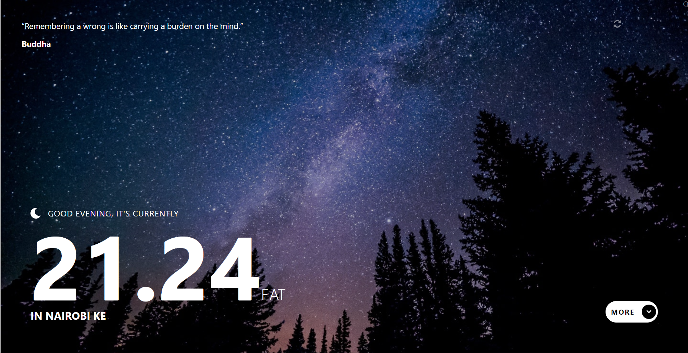
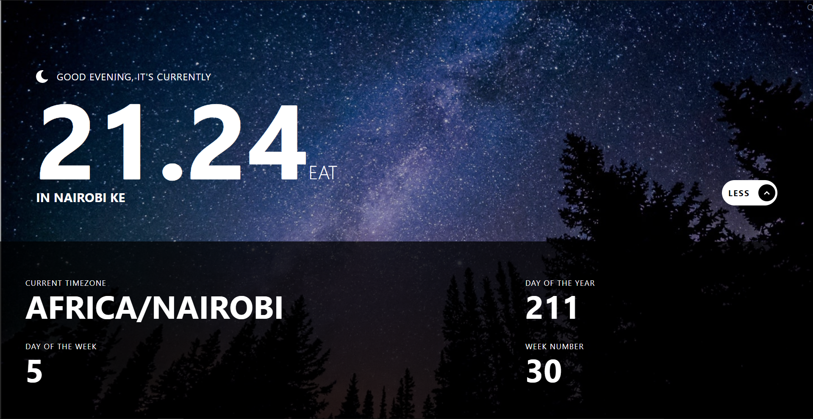

# Frontend Mentor - Clock app solution

This is a solution to the [Clock app challenge on Frontend Mentor](https://www.frontendmentor.io/challenges/clock-app-LMFaxFwrM). Frontend Mentor challenges help you improve your coding skills by building realistic projects. 

## Table of contents

- [Frontend Mentor - Clock app solution](#frontend-mentor---clock-app-solution)
  - [Table of contents](#table-of-contents)
  - [Overview](#overview)
    - [The challenge](#the-challenge)
    - [Screenshot](#screenshot)
    - [Links](#links)
  - [My process](#my-process)
    - [Built with](#built-with)
    - [What I learned](#what-i-learned)
    - [Continued development](#continued-development)
  - [Author](#author)

## Overview

### The challenge

Users should be able to:

- View the optimal layout for the site depending on their device's screen size
- See hover states for all interactive elements on the page
- View the current time and location information based on their IP address
- View additional information about the date and time in the expanded state
- Be shown the correct greeting and background image based on the time of day they're visiting the site
- Generate random programming quotes by clicking the refresh icon near the quote

### Screenshot

### Links

- Solution URL: [https://www.frontendmentor.io/solutions/clock-vue-3-typescript-tailwind-clean-architecture-dVUsqX9JW](https://www.frontendmentor.io/solutions/clock-vue-3-typescript-tailwind-clean-architecture-dVUsqX9JW)
- Live Site URL: [https://donmatano.github.io/Clock-app/](https://donmatano.github.io/Clock-app/)

## My process

### Built with

- Semantic HTML5 markup
- Vue 3
- Tailwind
- Clean Architecture / Port, Adapters

### What I learned

I was able to start getting grips of the Clean Architecture. Mostly the Port and Adapter Architecture. I was able to also learn how to use Vue 3 new option api. And dubbled into animation

### Continued development

More of the same. I want to grow my understanding of writing maintainable code and make beautiful responsive web layouts.

## Author

- Frontend Mentor - [@DonMatano](https://www.frontendmentor.io/profile/DonMatano)
- Twitter - [@MMatano5](https://www.twitter.com/MMatano5)
